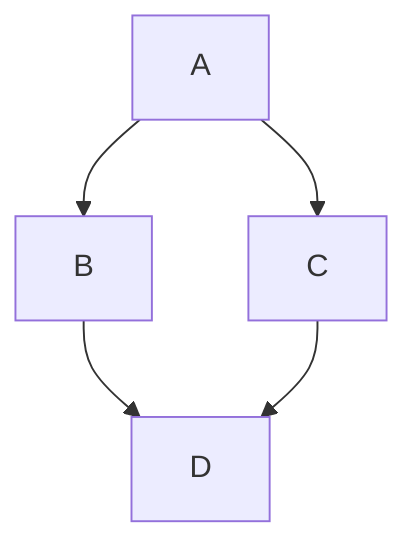

> 强大的 Markdown 编辑器

- 由 ByteMD 强力驱动，功能丰富、性能强劲
- 支持 GFM 扩展语法、脚注、Gemoji、KaTeX 数学公式、Mermaid 图表
- 支持通过 Frontmatter 设置多种主题、代码高亮样式
- 支持实时同步预览

## Markdown 基础语法

I just love **bold text**. Italicized text is the _cat's meow_. At the command prompt, type `nano`.

1. First item
2. Second item
3. Third item

> Dorothy followed her through many of the beautiful rooms in her castle.

```ts
const message = "Hello, Fastx MD Playground!";
console.log(message);
```

## GFM 扩展语法

Automatic URL Linking: https://github.com/ShenBao

~~The world is flat.~~ We now know that the world is round.

- [x] Write the press release
- [ ] Update the website
- [ ] Contact the media

| Syntax    | Description |
| --------- | ----------- |
| Header    | Title       |
| Paragraph | Text        |

## 脚注

Here's a simple footnote,[^1] and here's a longer one.[^bignote]

[^1]: This is the first footnote.
[^bignote]: Here's one with multiple paragraphs and code.

    Indent paragraphs to include them in the footnote.

    `{ my code }`

    Add as many paragraphs as you like.

## Gemoji

Thumbs up: :+1:, thumbs down: :-1:.

Families: :family_man_man_boy_boy:

Long flags: :wales:, :scotland:, :england:.

## Math Equation

Inline math equation: $a+b$

$$
\displaystyle \left( \sum_{k=1}^n a_k b_k \right)^2 \leq \left( \sum_{k=1}^n a_k^2 \right) \left( \sum_{k=1}^n b_k^2 \right)
$$

## Mermaid Diagrams



## Links

- [FastX Markdown Playground](https://github.com/ShenBao/fastx-md-playground)
- [ShenBao](https://github.com/ShenBao)
